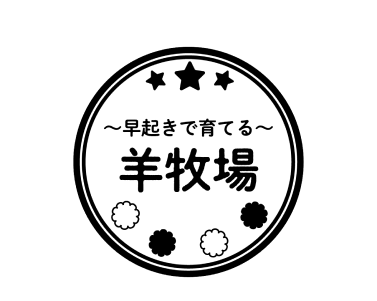

# KC3Hack 2021 Template

## プロダクト名

## プロダクト説明

**〜早起きで育てる〜羊牧場** は、「寝過ぎる人が朝起床したくなるサービス」である。
コロナ禍において、オンライン授業やウェブ面接など、日常生活でパソコンやスマホを使う時間が長くなったといえる。これらの変化から睡眠に問題が出る人が増加している。朝目覚めずらい、起床が難しい人にとって能動的に起きたくなる仕組みにすることで、コロナ禍の起床をサポートする。チームエンジニアの大半が Unity を学んでいたことから、ゲーミング要素のあるサービスとなった。

## 使用技術

- [Figma](https://www.figma.com/) - デザインツール
- [Unity](https://unity.com/) - ゲームエンジン
  - [DOTween](https://assetstore.unity.com/packages/tools/animation/dotween-hotween-v2-27676?locale=ja-JP) - Unity Asset
- [Noto Sans JP](https://www.google.com/get/noto/) - フォント
- 音声素材
  - [無料効果音で遊ぼう！](https://taira-komori.jpn.org/)
  - [効果音ラボ](https://soundeffect-lab.info/)
